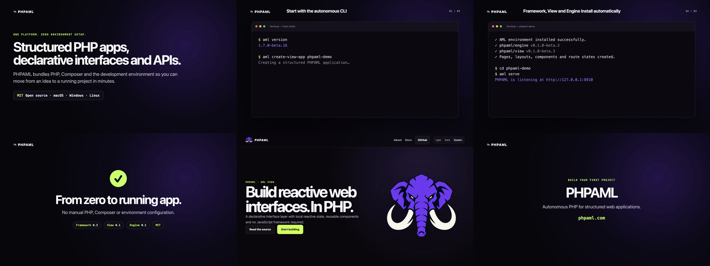
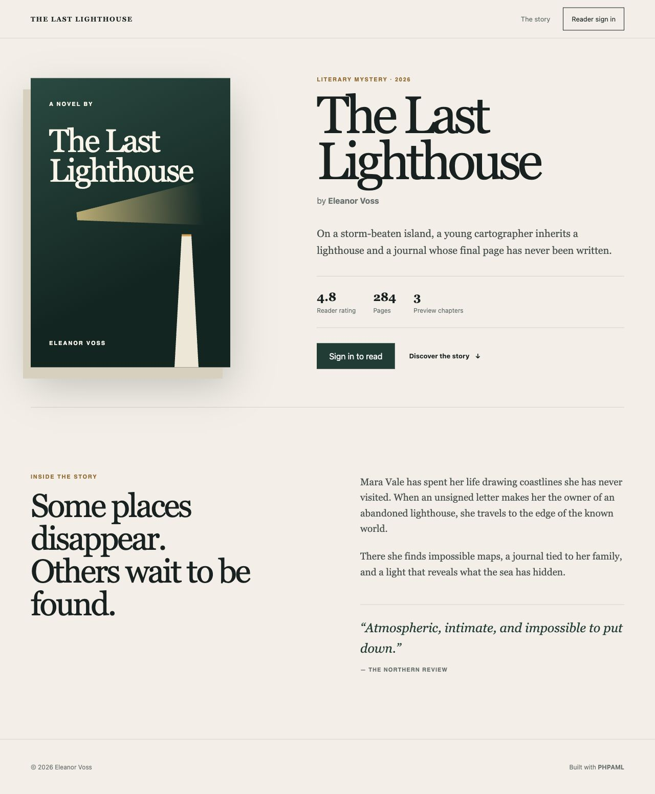

# PHPAML

[](https://github.com/MR-C0DE/phpaml-cli/releases/latest)
[](https://github.com/MR-C0DE/phpaml-cli/actions/workflows/test-cli.yml)
[](LICENSE)


**Créez des applications PHP structurées, des interfaces déclaratives et des
API sans configurer manuellement PHP, Composer ou l’environnement de
développement.**

PHPAML est une plateforme PHP autonome pour Windows, macOS et Linux. Sa
commande `aml` inclut PHP et Composer, crée des projets prêts à fonctionner,
vérifie leur environnement et les accompagne du développement local jusqu’à
une archive de production vérifiée.

[Site officiel](https://phpaml.com/fr) · [Documentation](https://phpaml.com/fr/docs) ·
[Démo publique](https://phpaml-book-reader-demo.onrender.com) ·
[Releases](https://github.com/MR-C0DE/phpaml-cli/releases/latest) ·
[English](README.md)

[](docs/assets/demo/phpaml-demo-no-voice.mp4)

_[Regardez la démonstration de 36 secondes, sans voix](docs/assets/demo/phpaml-demo-no-voice.mp4) :
la CLI autonome crée et lance une véritable application AML View._

[](https://phpaml-book-reader-demo.onrender.com)

_Book Reader est une application PHPAML complète. [Ouvrez la démo](https://phpaml-book-reader-demo.onrender.com)
ou [consultez son code source](https://github.com/MR-C0DE/phpaml-book-reader-demo)._

> PHPAML est actuellement en bêta. Il est prêt pour l’exploration et la
> validation dans des projets réels, mais toute application en production doit
> suivre la [liste de vérification](docs/tests-production-depannage.md).

## De l’installation à l’application fonctionnelle

Installez PHPAML depuis la [dernière release](https://github.com/MR-C0DE/phpaml-cli/releases/latest),
puis créez une application :

```bash
aml create mon-app
cd mon-app
aml install
aml doctor
aml serve
```

Ouvrez **http://127.0.0.1:8910**. Vous obtenez une application MVC fonctionnelle
avec routage, injection de dépendances, vues, validation, sessions, protection
CSRF, PDO, migrations, tests et actualisation automatique.

```text
✓ Moteur PHPAML installé
✓ Diagnostic du projet réussi
→ PHPAML écoute sur http://127.0.0.1:8910
```

Aucune installation globale de PHP, Composer ou Node.js n’est nécessaire.

## Choisissez ce que vous voulez construire

### Une application Web structurée

```bash
aml create mon-app
cd mon-app
aml install
aml serve
```

Commencez avec une architecture MVC conventionnelle, puis ajoutez contrôleurs,
modèles, middlewares, migrations et vues à mesure que l’application grandit.

### Une interface déclarative

```bash
aml create-view-app mon-interface
cd mon-interface
aml doctor
aml serve
```

Créez en PHP des interfaces typées à base de composants avec AML View et le
moteur réactif. Découvrez les démos [Book Reader](https://phpaml-book-reader-demo.onrender.com)
et [Chess Tutor](https://phpaml-chess-tutor.onrender.com).

### Une API JSON

```bash
aml create-api films-api
cd films-api
aml install
aml serve
```

Partez d’une structure dédiée aux API avec configuration CORS, validation,
accès aux données, migrations et outils OpenAPI. Explorez le
[code de Movies API](https://github.com/MR-C0DE/phpaml-movies-api-demo).

## Une plateforme, des paquets spécialisés

Les dépôts séparés permettent à chaque paquet d’évoluer et de s’installer
indépendamment. Ensemble, ils forment une seule plateforme :

| Dépôt | Rôle |
| --- | --- |
| [`phpaml-cli`](https://github.com/MR-C0DE/phpaml-cli) | Environnement AML autonome, installateurs, cycle de vie des projets et commandes de développement |
| [`phpaml-framework`](https://github.com/MR-C0DE/phpaml-framework) | HTTP, routage, MVC, middlewares, validation, sécurité et fondation d’exécution |
| [`phpaml-view`](https://github.com/MR-C0DE/phpaml-view) | Interfaces déclaratives à base de composants écrites en PHP |
| [`phpaml-engine`](https://github.com/MR-C0DE/phpaml-engine) | Moteur réactif côté navigateur utilisé par AML View |
| [`phpaml-data`](https://github.com/MR-C0DE/phpaml-data) | Accès aux données, schémas et migrations |
| [`phpaml-template`](https://github.com/MR-C0DE/phpaml-template) | Structure initiale générée pour les applications classiques |

## Ce que `aml` prend en charge

- Environnement PHP et Composer autonome
- Création de projets MVC, AML View et API JSON
- Installation des dépendances et du framework avec vérification SHA-256
- Diagnostic de l’environnement et de la santé du projet
- Générateurs, routes, migrations, tests et actualisation automatique
- Archives de production vérifiées, profils de déploiement et retour arrière
- Sortie de la CLI en anglais et en français

Exécutez `aml help` pour voir la référence complète des commandes.

## Apprendre PHPAML

- [Documentation officielle](https://phpaml.com/fr/docs)
- [Tutoriel progressif](https://phpaml.com/fr/tutorial)
- [Guide d’installation](docs/installation.md)
- [Référence de la CLI](docs/cli.md)
- [Architecture](docs/architecture.md)
- [Guide AML View](docs/aml-view.md)
- [Politique de sécurité](SECURITY.md)
- [Liste de vérification avant publication](docs/release-checklist.md)
- [Projet de lancement PHPAML CLI 1.7.0-beta.15](docs/launch-1.7.0-beta.15.md)
- [Mesures d’adoption avant lancement](docs/adoption-baseline-2026-08-23.md)
- [Mesure d’adoption respectueuse de la vie privée](docs/adoption-measurement.md)
- [Audit de publication PHPAML CLI 1.7.0-beta.15](docs/release-audit-1.7.0-beta.15.md)

## Contribuer

PHPAML est jeune : les premiers retours ont une influence considérable. Les
rapports de bogues, résultats d’installation sur les plateformes prises en
charge, améliorations documentaires et pull requests ciblées sont bienvenus.
Lisez [CONTRIBUTING.md](CONTRIBUTING.md) et notre
[Code de conduite](CODE_OF_CONDUCT.md) avant de participer.

[Partagez le résultat de votre installation](https://github.com/MR-C0DE/phpaml-cli/issues/new?template=installation-report.yml),
même lorsque tout a fonctionné. Les premiers essais réussis et échoués sont
tous deux utiles.

Pour signaler l’échec d’une installation ou d’un premier projet, indiquez la
plateforme, la version de PHPAML, la commande concernée et une sortie nettoyée
de toute donnée sensible. Cela nous aide à améliorer le taux de réussite sans
télémétrie cachée.

## Licence

PHPAML CLI est un logiciel open source distribué sous [licence MIT](LICENSE).
