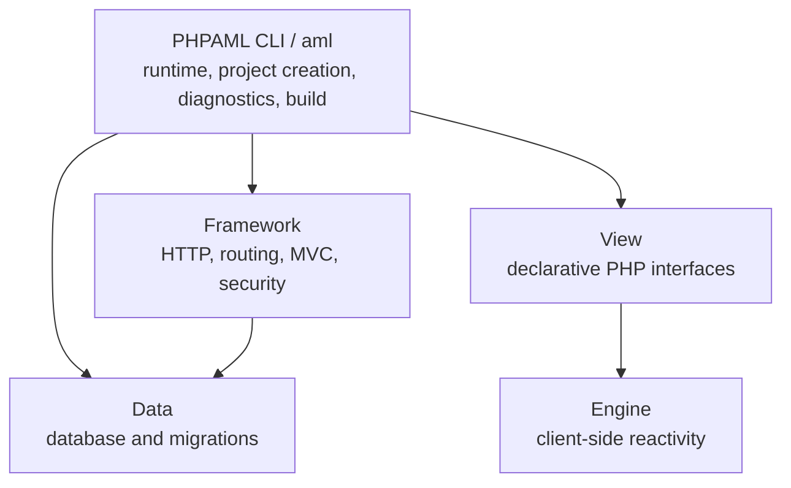

# PHPAML

[](https://github.com/MR-C0DE/phpaml-cli/releases/latest)
[](https://github.com/MR-C0DE/phpaml-cli/actions/workflows/test-cli.yml)
[](LICENSE)


**Build structured PHP applications, declarative interfaces, and APIs without
manually setting up PHP, Composer, or a development environment.**

PHPAML is a self-contained PHP platform for Windows, macOS, and Linux. Its
`aml` command bundles PHP and Composer, creates ready-to-run projects, checks
their environment, and takes them from local development to a verified
production build.

[Website](https://phpaml.com) · [Documentation](https://phpaml.com/docs) ·
[Live demo](https://phpaml-book-reader-demo.onrender.com) ·
[Releases](https://github.com/MR-C0DE/phpaml-cli/releases/latest) ·
[Start contributing](https://github.com/MR-C0DE/phpaml-cli/issues?q=is%3Aissue%20state%3Aopen%20label%3A%22good%20first%20issue%22) ·
[Français](README.fr.md)

> **New to PHPAML?** Pick a scoped
> [`good first issue`](https://github.com/MR-C0DE/phpaml-cli/issues?q=is%3Aissue%20state%3Aopen%20label%3A%22good%20first%20issue%22),
> read the [contribution guide](CONTRIBUTING.md), and ask questions in
> [GitHub Discussions](https://github.com/MR-C0DE/phpaml-cli/discussions/37).

[](docs/assets/demo/phpaml-demo-no-voice.mp4)

_[Watch the 36-second, no-voice demo](docs/assets/demo/phpaml-demo-no-voice.mp4):
the autonomous CLI creates and runs a real AML View application._

[](https://phpaml-book-reader-demo.onrender.com)

_Book Reader is a complete PHPAML application. [Open the live demo](https://phpaml-book-reader-demo.onrender.com)
or [read its source](https://github.com/MR-C0DE/phpaml-book-reader-demo)._

> PHPAML is currently in beta. It is ready for exploration and real-world
> validation, but production applications should follow the
> [production checklist](docs/tests-production-depannage.md).

## From install to running app

Install PHPAML from the [latest release](https://github.com/MR-C0DE/phpaml-cli/releases/latest),
then create an application:

```bash
aml create my-app
cd my-app
aml install
aml doctor
aml serve
```

Open **http://127.0.0.1:8910**. You get a working MVC application with routing,
dependency injection, views, validation, sessions, CSRF protection, PDO,
migrations, tests, and live reload.

```text
✓ PHPAML engine installed
✓ Project diagnostics passed
→ PHPAML is running at http://127.0.0.1:8910
```

No global PHP, Composer, or Node.js installation is required.

## Choose what you want to build

### A structured web application

```bash
aml create my-app
cd my-app
aml install
aml serve
```

Start with a conventional MVC structure and add controllers, models,
middleware, migrations, and views as the application grows.

### A declarative interface

```bash
aml create-view-app my-interface
cd my-interface
aml doctor
aml serve
```

Build typed, component-based interfaces in PHP with AML View and the reactive
Engine. See the [Book Reader](https://phpaml-book-reader-demo.onrender.com) and
[Chess Tutor](https://phpaml-chess-tutor.onrender.com) demos.

### A JSON API

```bash
aml create-api movies-api
cd movies-api
aml install
aml serve
```

Start with an API-oriented structure, CORS configuration, validation, data
access, migrations, and OpenAPI tooling. Explore the
[Movies API source](https://github.com/MR-C0DE/phpaml-movies-api-demo).

## One platform, focused packages

PHPAML is presented through separate repositories so each package can evolve
and be installed independently. They form one platform:



| Repository | Role |
| --- | --- |
| [`phpaml-cli`](https://github.com/MR-C0DE/phpaml-cli) | Self-contained AML environment, installers, project lifecycle, and developer commands |
| [`phpaml-framework`](https://github.com/MR-C0DE/phpaml-framework) | HTTP, routing, MVC, middleware, validation, security, and runtime foundation |
| [`phpaml-view`](https://github.com/MR-C0DE/phpaml-view) | Declarative, component-based interfaces written in PHP |
| [`phpaml-engine`](https://github.com/MR-C0DE/phpaml-engine) | Reactive browser runtime used by AML View applications |
| [`phpaml-data`](https://github.com/MR-C0DE/phpaml-data) | Data access, schemas, and migrations |
| [`phpaml-template`](https://github.com/MR-C0DE/phpaml-template) | Starting structure generated for classic applications |

## What `aml` handles

- Self-contained PHP and Composer environment
- Project creation for MVC, AML View, and JSON API applications
- Dependency and framework installation with SHA-256 verification
- Environment diagnostics and project health checks
- Code generators, routes, migrations, tests, and live reload
- Verified production archives, deployment profiles, and rollback
- English and French CLI output

Run `aml help` to see the complete command reference.

## Learn PHPAML

- [Official documentation](https://phpaml.com/docs)
- [Progressive tutorial](https://phpaml.com/tutorial)
- [Installation guide](docs/installation.md)
- [CLI reference](docs/cli.md)
- [Architecture](docs/architecture.md)
- [AML View guide](docs/aml-view.md)
- [Security policy](SECURITY.md)
- [Public release checklist](docs/release-checklist.md)
- [PHPAML CLI 1.7.0-beta.16 community launch pack](docs/launch-1.7.0-beta.16.md)
- [PHPAML CLI 1.7.0-beta.16 contributor backlog](docs/contributor-backlog-1.7.0-beta.16.md)
- [Pre-launch adoption baseline](docs/adoption-baseline-2026-08-23.md)
- [Privacy-first adoption measurement](docs/adoption-measurement.md)
- [PHPAML CLI 1.7.0-beta.15 release audit](docs/release-audit-1.7.0-beta.15.md)

## Contributing

PHPAML is young, and early feedback has an outsized impact. Bug reports,
installation results on supported platforms, documentation improvements, and
focused pull requests are welcome. Read [CONTRIBUTING.md](CONTRIBUTING.md) and
our [Code of Conduct](CODE_OF_CONDUCT.md) before participating.

[Share your installation result](https://github.com/MR-C0DE/phpaml-cli/issues/new?template=installation-report.yml),
even when everything worked. Successful and failed first runs are both useful.

When reporting an installation or first-project failure, include the platform,
PHPAML version, command that failed, and sanitized output. This helps us improve
the first-run success rate without collecting hidden telemetry.

## License

PHPAML CLI is open-source software licensed under the [MIT License](LICENSE).


## Developer Reference #38
Resolves issue #38: Document one clean first run on Windows, macOS, or Linux.
